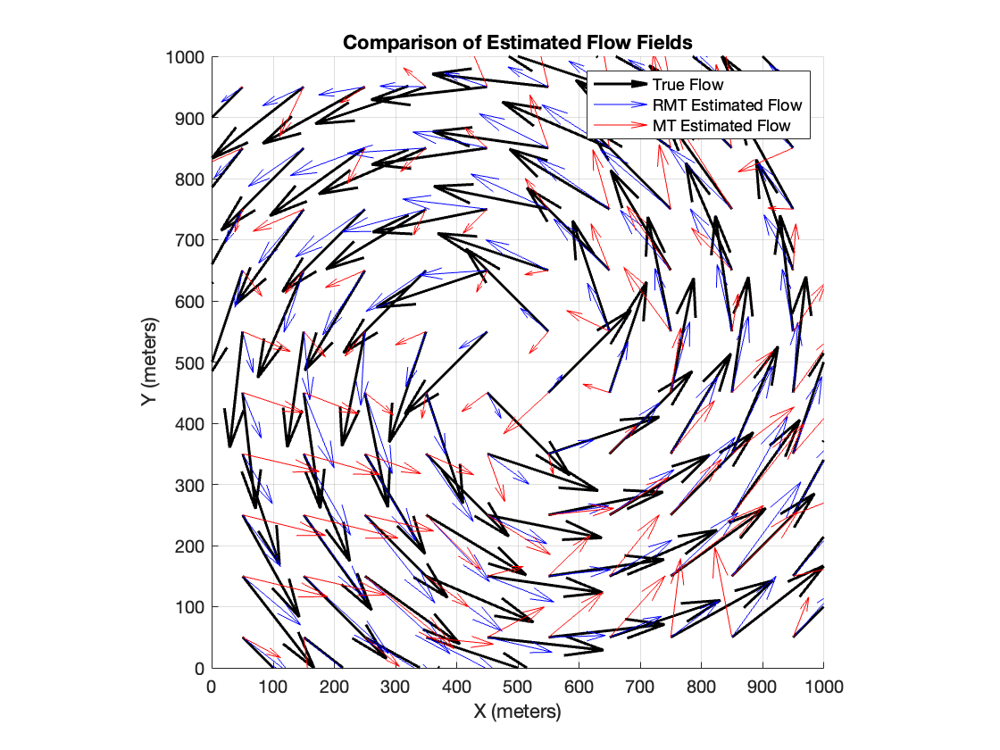
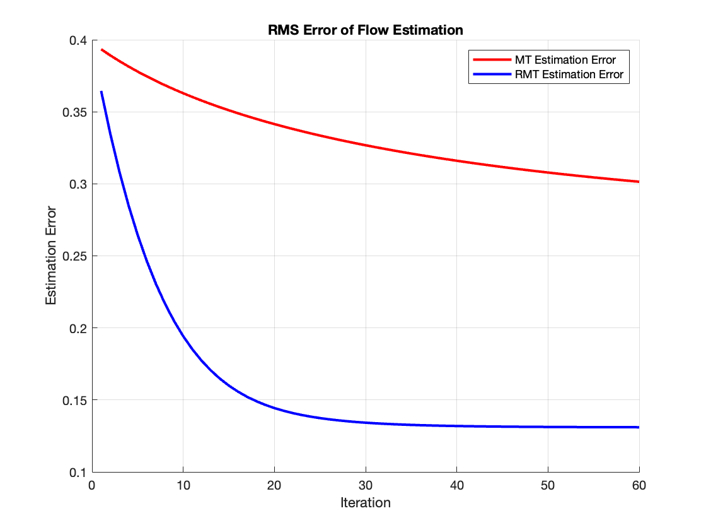

This repository contains MATLAB code to reproduce the numerical experiments from the paper:

> *"Laplacian Regularized Motion Tomography for Underwater Vehicle Flow Mapping"*  

It implements the **Motion Tomography (MT)** and **Regularized Motion Tomography (RMT)** algorithms to estimate oceanic flow fields from simulated Autonomous Underwater Vehicle (AUV) trajectories.

---
### Flow Field Comparison

### RMS Error Convergence

## Features

- Simulates a 2D underwater flow field (cyclonic vortex) over a square domain.
- Generates AUV trajectories and travel time data based on controlled motions.
- Implements **MT** and **RMT** iterative algorithms for flow field estimation.
- Computes RMS error over iterations to evaluate estimation accuracy.
- Produces comparison plots for:
  - True vs. estimated flow fields.
  - Convergence of MT and RMT algorithms.

---

## Requirements

- MATLAB R2019b or later.
- Basic MATLAB toolboxes (`MATLAB` core functions only).

---

## Simulation Overview

1. **Setup Domain and True Flow Field**  
   - Domain: 1000 × 1000 meters.  
   - Grid: 10 × 10 cells.  
   - True flow: Cyclonic field centered in the domain.

2. **AUV Trajectories and Data Collection**  
   - 18 simulated AUVs (9 starting from left edge, 9 from bottom edge).  
   - Constant speed and controlled direction.  
   - Travel times collected per grid cell.

3. **Flow Estimation Algorithms**  
   - **Motion Tomography (MT)**: Iterative least-squares update.  
   - **Regularized Motion Tomography (RMT)**: Incorporates Laplacian regularization for smoother flow estimates.  
   - Laplacian matrix encodes neighboring cell relationships.

4. **Evaluation Metrics**  
   - RMS error between true flow and estimated flow.
   - Visualization of estimated vs. true flow fields.

---

3. The script will generate:
   - **Flow Field Comparison**: Quiver plots of true and estimated flow.
   - **RMS Error Convergence**: Error curves for MT and RMT.

